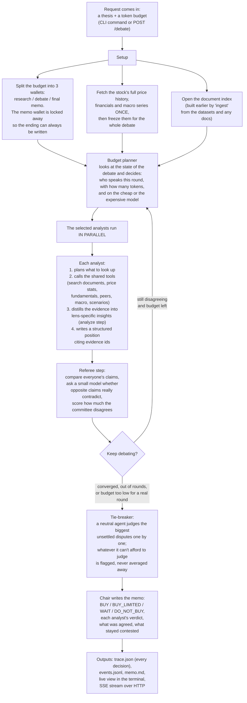
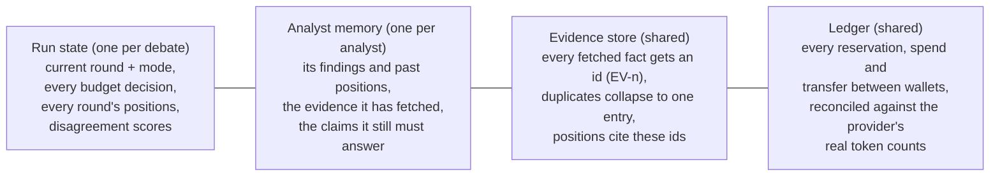

# Investment Committee

Multi-agent debate over an investment thesis under a hard token budget. Four analyst agents with different reasoning lenses research a thesis (RAG over a document corpus plus live yfinance data), argue across rounds, and a non-voting Chair writes the committee memo: `BUY`, `BUY_LIMITED` (with position guidance), `WAIT`, or `DO_NOT_BUY`. The orchestrator decides how to spend reasoning tokens: research vs argument, breadth vs depth, flash vs pro model, and who gets to speak in each round.

Jnaara take-home, Problem A. Python 3.12, LangGraph, Gemini (`2.5-flash` / `2.5-pro`), Chroma, FastAPI.

## Quickstart

```bash
poetry install
cp .env.example .env             # put your GEMINI_API_KEY in it
poetry run python -m committee ingest data/                       # build the corpus index (one-time)
poetry run python -m committee debate \
  --thesis "NVIDIA looks overextended. Buy now, wait, or avoid?" \
  --ticker NVDA --budget 60000
poetry run pytest                # no network needed; runs on a fake LLM
poetry run python -m committee serve --port 8000                  # FastAPI + SSE
```

API: `POST /debate {thesis, ticker?, entity?, budget?, policy?}` returns `{run_id}`; `GET /debate/{id}` returns the full trace; `GET /debate/{id}/stream` is SSE (`curl -N localhost:8000/debate/<id>/stream`).

Every run writes `runs/<run_id>/`: `trace.json` (the full structured trace, including every budget decision), `events.jsonl` (live event stream), and `memo.md`.

## Example output

A complete run is committed for inspection without running anything: [`examples/nvda-trace.json`](examples/nvda-trace.json) (the full structured trace of the live NVDA debate, including every budget decision) and [`examples/nvda-memo.md`](examples/nvda-memo.md) (its memo).

## Example runs (local `runs/`, not committed)

| Run | What it shows |
|---|---|
| `runs/174b41d5cc` | Live NVDA debate. Result: `BUY_LIMITED` at 0.70 confidence with sizing guidance, grounded in real yfinance stats: margins, z-score vs the 200DMA, relative strength vs peers. |
| `runs/213a84b034` | Corpus (RAG) debate on NovaTech, a fictional company from the provided dataset. Shows the explore-to-exploit transition (7 contested claims at R2, exploit rounds funding the top parties at the pro tier), tie-breakers adjudicating the surviving disputes, and a `DO_NOT_BUY` memo on governance red flags. |
| `runs/e4d805e0d3` | Uniform-policy baseline on the same thesis: disagreement stays flat at 0.52 across all rounds and nothing gets adjudicated. This is the control for the explore-exploit policy. |
| `runs/85b7a6b852` | A 25k budget run: agents get skipped with logged reasons, the synthesis pool survives, and a memo still comes out. Graceful degradation. |

## Architecture

### How a request flows



### Where state lives while this runs



Round N+1 is assembled from this state: each analyst gets its own accumulated evidence, a compressed view of what the others argued in round N, and the list of claim ids it must answer. Nothing depends on a chat history; the debate can be replayed from the trace and the frozen market snapshot.

### The four lenses (`committee/agents/lenses.py`)

The Fundamentalist asks what the business is actually worth. Momentum/Trend asks what the market is telling us. Quality/Moat asks whether the company can keep winning, and is explicitly forbidden from arguing on valuation multiples. Risk/Macro asks what can go wrong, and has to quantify the downside and give sizing guidance. Each `LensSpec` carries priorities, a `does_not_weigh` list (enforced blind spots), buy/sell triggers, a personality, and preferred tools. Adding a fifth analyst is one registry entry; the orchestrator doesn't change.

### Rounds

Inside a round each analyst runs plan, fetch, analyze, argue: after fetching, an explicit analyze call distills the evidence into derived judgments (trends, gaps, scenario implications, contradictions) that feed the argument, so claims are built on comparisons rather than restated levels. R1 (DISCOVER) is research-heavy and produces findings only: observations, open questions, falsifiers. No stances, because forcing a stance before research invites anchoring. R2 (EXPLORE) produces first positions: claims with direction, importance, and evidence ids. From R3 on (EXPLOIT), when contested claims exist, the policy funds the parties to those claims at the pro tier with `must_address` obligations. Each agent must CONCEDE, PARTIAL, REBUT, or INCORPORATE every contested claim it owns or disputes, and a validator rejects silence. The explore-to-exploit transition is a function of debate state, never a hardcoded round number.

### Budget (the core meta-decision)

The budget counts total tokens (input plus output) across every LLM call, split into three pools: research, debate, and synthesis. The synthesis pool is untouchable by analysts, so the Chair always gets to speak. The `Ledger` requires a reservation before every call and reconciles against the provider's real `usage_metadata` afterward. Reservations account for estimated prompt input (chars/3, deliberately conservative) plus a schema and thinking overhead, so a call that can't fund a minimal useful output gets skipped and logged rather than truncated into garbage.

Policies are deterministic, pluggable code in the `policies/` registry: `uniform` (the baseline) and `explore_exploit` (mode derived from disagreement state; exploit funds the top contested parties at realistic allocations and folds leftover research budget into debate). Every `BudgetDecision` lands in the trace: allocations, tier choices, transfers, rationale, and a snapshot of the state that produced it.

### Disagreement (claim-level, never averaged)

Two signals: stance entropy across the committee, and claim-level contradiction. Embeddings pre-filter opposite-direction cross-lens claim pairs (capped, most similar first), then a flash judge confirms whether a pair genuinely contradicts. Contested claims drive exploit-round funding and `must_address` lists. Convergence means a low weighted disagreement score with a non-increasing delta. After the final round, surviving contested claims go to a tie-breaker agent (pro tier, top-k by score, funded from debate-pool leftovers only); the rest are flagged unresolved with reasoning, visible in the memo rather than hidden.

### Data plane: numbers never come from the model

Two stores. Chroma holds text only: the two provided datasets (84 facts and 52 decisions, one record per chunk, with entity/source/reliability/date metadata) plus any md/txt docs, chunked header-aware. `MarketSnapshot` holds numbers: full daily OHLCV history, financial statements, and macro series, fetched once at debate start and then frozen, so every agent in every round sees the same data. No mid-debate drift, and replays are reproducible. Tools compute statistics in pandas and return typed summaries; the LLM reads computed facts and never does arithmetic on raw rows. All seven tools (`search_corpus`, `entity_timeline`, `company_snapshot`, `price_stats`, `peer_compare`, `macro_context`, `scenario_math`) live in a shared registry. The market tools return trajectories and comparisons, not just levels: quarterly revenue with per-quarter YoY, margin trend by year, FCF history, share dilution, volume trend, 52-week range position, correlation and beta vs the index, and a deterministic what-if calculator (project revenue at a growth rate, apply a margin and an exit multiple, get implied price vs today). `entity_timeline` returns every corpus record about an entity in time order, because the datasets' signal is in sequences (claim, denial, restatement) that similarity fragments hide. Agents choose which to call and with what args, but never define their own. Results are cached per run and registered as `Evidence` with provenance, so claims cite `EV-n` ids that trace back to a source.

## Key design decisions and tradeoffs

- **Deterministic meta-control, not an LLM supervisor.** Mode selection, speaker selection, token allocation, and model tiering are plain Python reading `DebateState`. The assignment's core question is about allocating reasoning resources, and that logic should be inspectable, testable, and reproducible. An `LLMSupervisorPolicy` would be one more registry entry if wanted. The tradeoff is less "agentic" flavor for much stronger auditability.
- **Rounds are parallel fan-out/fan-in, not sequential turns.** 4x less wall-clock and no first-speaker bias, at the cost that agents react to the previous round rather than to each other mid-round.
- **Total-token budgeting (input plus output).** Honest but hard: input grows with debate context, so the system has to compress (evidence render caps, claim-only summaries of other analysts) and estimate input before reserving. Output-only budgeting would have been simpler, but an agent could game it by stuffing context. Some estimate error remains; the ledger records actual vs reserved for audit.
- **R1 has no stances.** Discovery-then-position produced visibly better debates than forcing an opinion before research. It costs one round of budget before any position exists, which is why the minimum is 3 rounds, within the assignment's 2-to-3 spirit.
- **Frozen market snapshot.** Consistency across agents and reproducibility beat freshness. This is an investment debate, not trading. `--offline` replays without network.
- **In-process asyncio, no Celery/Redis.** The workload is I/O-bound LLM calls, and a queue adds ops burden for a take-home reviewers must run. The API's background-task runner sits behind a small seam that a real deployment would swap for a distributed queue.
- **Considered and rejected**: an LLM supervisor for allocation (unauditable), a devil's-advocate fifth lens (cut for scope), sequential turn-taking (latency and first-speaker bias), embedding raw price history (retrieving numbers by similarity is how hallucinations happen), and a Next.js frontend (the CLI live view plus SSE covers the streaming story).

## What broke and what I learned (honest log)

1. Gemini structured output can't take free-form dicts. `ToolRequest.args: dict[str, Any]` failed 100% of the time; I flattened it to typed optional fields.
2. Gemini 2.5 thinking tokens silently eat `max_output_tokens`. Small caps meant truncated JSON and schema failures. Fixed with an explicit `thinking_budget` (0 for flash, small for pro) and output caps that account for it.
3. Budget enforcement is an economics problem. The first version reserved only output, so pools overshot on input. The second starved research plans by capping totals below prompt size. The third let judges drain the debate pool mid-assessment and tie-breakers drain the synthesis pool. The final shape has input-aware reservations, per-kind schema overheads, judge-pair caps, tie-break caps, pool isolation for synthesis, and a stop rule for when the remaining budget can't fund a realistic round. Every one of those failures is visible in the git history.
4. Exact-match metadata filters are a silent RAG killer. `entity="NovaTech"` vs stored `"NovaTech Inc."` returned zero results, and the committee concluded "no data exists" with high confidence: a convincing, wrong debate. Normalized entity keys fixed it. The lesson is that retrieval failures masquerade as confident conclusions.

## Prompts

System and agent prompts are committed and templated per lens in `committee/agents/prompts/`: `analyst_system.md`, `plan_user.md`, `findings_user.md`, `position_user.md`, `chair_system.md`, `chair_user.md`, `tiebreak_user.md`. The judge prompt is inline in `committee/debate/disagreement.py`.

The full prompt log for the AI coding tools used during development, and the generated-vs-refactored breakdown, are in [`docs/ai-log.md`](docs/ai-log.md).

## Tests

`poetry run pytest` runs 17 tests with no network, using a scripted `FakeProvider` and a deterministic `FakeEmbedder`. They cover structured-output validation (schema bounds, `BUY_LIMITED` requires guidance, `must_address` completeness), budget enforcement (reservation invariants, synthesis-pool lockout, transfer rules, truncation), policy logic (discover/explore/exploit transitions, party selection, tier upgrades, research fold-in), and a full end-to-end orchestrator run asserting round modes, contested-claim detection, exploit targeting, convergence stop, trace/memo/event outputs, and total spend within budget.
